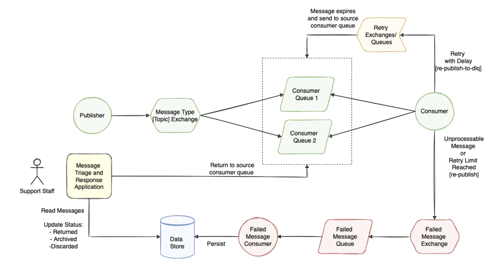

### Rabbit MQ

#### Task1
Implement a Spring Boot application for sending notifications to customers
about the receipt of goods based on the following architecture:


Failed Message Exchange is not configured as DLX for the source queues.
Consumer is responsible to re-publish failed messages.

#### Task2
Update previous implementation and change retry mechanism from inprocess to retry exchange/queue. Retry queue should have ttl, after message
expires it should be routed to the source queue.


Retry exchange is not configured as DLX for the source queues. Consumer
is responsible to re-publish messages for retry. If retry limit reached
message should be re-published to Failed Message Exchange instead.

#### Task3
Update previous implementation, configure message ttl, max size and dlx
attributes on consumer queues. Expired messages or during queue overflow
messages should be sent to DLQ by broker.


Dead Letter exchange should be specified as DLX attribute on source
queues in addition to message TTL and max length attributes.

#### Testing data
```
curl --location --request POST 'http://localhost:1362/epam/rabbit-mq/publisher/publish' \
--header 'Content-Type: text/plain' \
--data-raw 'Hello World!'
```